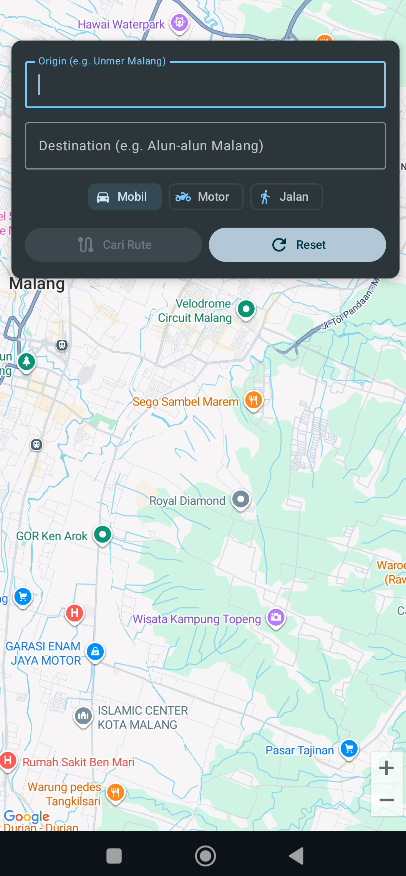
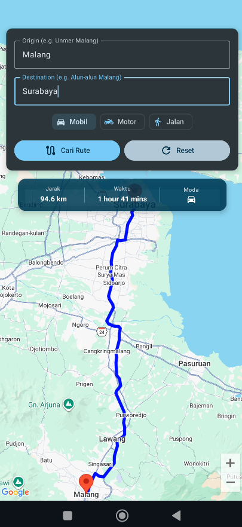
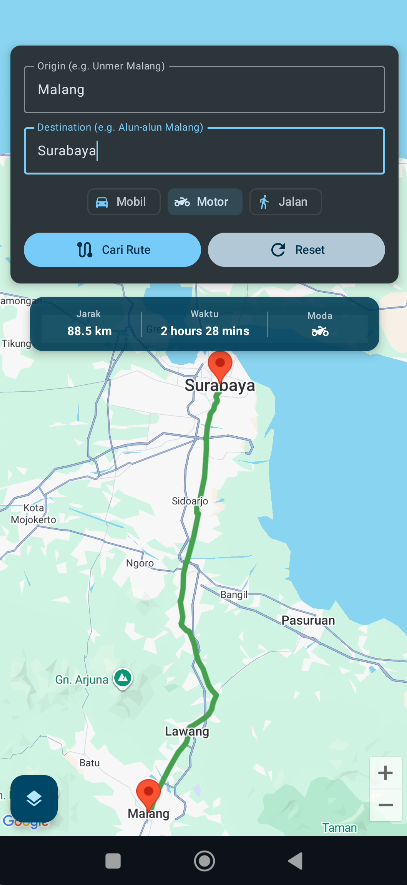
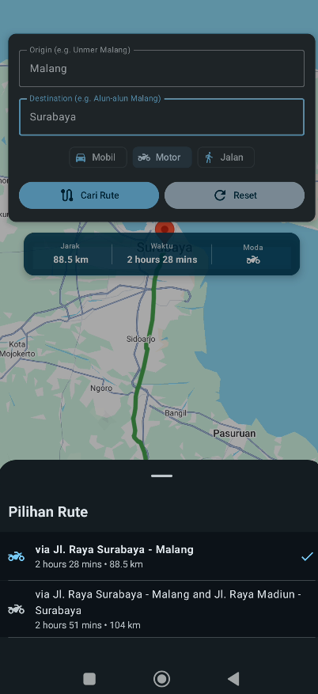
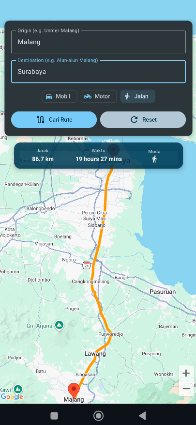
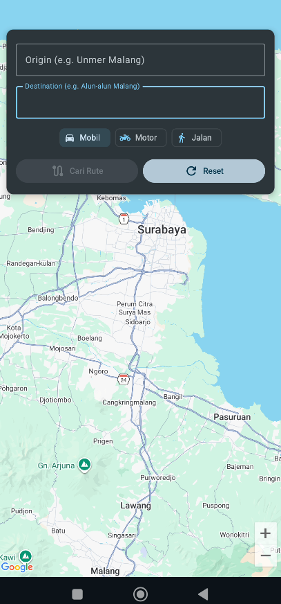

# 📝 Informasi Mahasiswa
**Nama**: Risqullah Fani Fadhilrif'at  
**NIM**: 22083000044  
**Kelas**: 6A2  
**Matakuliah**: Pemrograman Mobile

---

# 🗺️ MyMap - Smart Navigation App

**MyMap** adalah aplikasi navigasi Android modern yang dibangun menggunakan **Jetpack Compose** dan **Google Maps Platform**. Aplikasi ini memungkinkan pengguna untuk mencari rute antar lokasi dengan berbagai moda transportasi dan memilih rute alternatif melalui antarmuka yang elegan.

---

## ✨ Fitur Utama

### 1. 🚗 Pilihan Moda Transportasi
Tersedia tiga pilihan moda transportasi dengan optimasi rute khusus:
- **Mobil (Driving)**: Rute standar untuk kendaraan roda empat (termasuk jalan tol).
- **Motor (Two-wheeler)**: Rute khusus motor yang secara otomatis **menghindari jalan tol**.
- **Jalan Kaki (Walking)**: Rute yang dioptimalkan untuk pejalan kaki.

### 2. 🛣️ Rute Alternatif & BottomSheet
- Menampilkan semua pilihan rute yang tersedia dari Google Maps.
- Antarmuka **BottomSheet** yang dapat diakses untuk melihat daftar rute lengkap dengan informasi "via", jarak, dan durasi.
- Klik pada daftar rute untuk langsung memperbarui jalur di peta.

### 3. 📱 UI Modern & "Floating" Style
- **Full-screen Map**: Peta memenuhi seluruh layar sebagai background.
- **Floating Info Card**: Kartu informasi transparan yang melayang di atas peta, menampilkan detail jarak dan waktu secara ringkas dengan ukuran font yang dioptimalkan.
- **Floating Action Button (FAB)**: Tombol akses rute alternatif yang diletakkan di pojok kiri bawah untuk navigasi yang ergonomis.

---

## 🛠️ Teknologi yang Digunakan

- **Bahasa**: Kotlin
- **UI Framework**: Jetpack Compose (Material 3)
- **Maps**: Google Maps SDK for Android & Maps Compose Library
- **Networking**: Retrofit & OkHttp
- **API Google Maps**: 
  - Directions API (Rute & Alternatif)
- **Iconography**: Material Icons Extended

---

## 🚀 Cara Menjalankan Project

1. **Clone Repository**:
   ```bash
   git clone https://github.com/username/mymap.git
   ```
2. **Setup API Key**:
   - Dapatkan API Key dari [Google Cloud Console](https://console.cloud.google.com/).
   - Pastikan **Maps SDK for Android** dan **Directions API** telah diaktifkan.
   - Tambahkan API Key ke file `secrets.xml` atau langsung di `MapScreen.kt`.
3. **Build & Run**:
   - Buka project di Android Studio.
   - Hubungkan perangkat Android atau jalankan Emulator.
   - Tekan `Run`.

---

## 📸 Galeri Screenshot

Berikut adalah visualisasi fitur-fitur utama aplikasi MyMap:

| Tampilan Utama | Hasil Rute (Mobil) | Hindari Tol (Motor) |
| :---: | :---: | :---: |
|  |  |  |

| Daftar Alternatif | Mode Jalan Kaki | Fitur Reset |
| :---: | :---: | :---: |
|  |  |  |

---

Developed with ❤️ by Arlian Nasrul Ramadhani.
